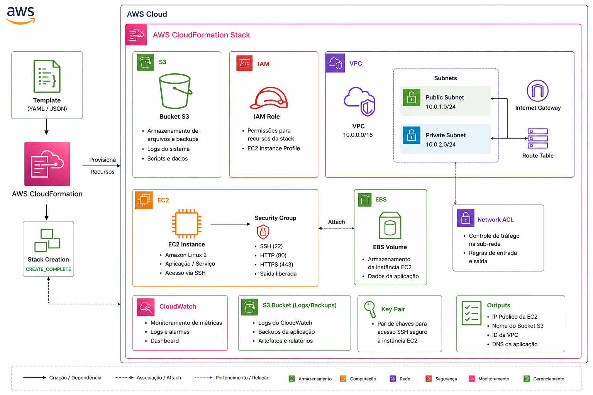

# AWS CloudFormation Stack
>Desafio AWS CloudFormation do Bootcampo Code Girls 2025.
>Projeto prático de criação da primeira stack com a CloudFormation

## 🧱 Implementando sua Primeira Stack com AWS CloudFormation ##

&nbsp; &nbsp; &nbsp; &nbsp; O AWS CloudFormation é um serviço que permite criar e gerenciar recursos da AWS de forma automatizada, utilizando modelos (templates) em formato YAML ou JSON. Em vez de configurar manualmente cada serviço pela console, o CloudFormation executa o provisionamento de forma padronizada, segura e repetível.

&nbsp; &nbsp; &nbsp; &nbsp; A seguir, estão os passos essenciais para implementar sua primeira stack:

 
1. Entender o conceito de Stack e Template

- Template: é o arquivo que descreve os recursos da sua infraestrutura (como EC2, S3, Lambda, VPC etc.).
- Stack: é o conjunto de recursos criados e gerenciados pelo CloudFormation a partir de um template.
Ou seja, você escreve o template, e o CloudFormation cria a stack correspondente.

 
2. Criar o Template

Você pode criar o template de duas formas:

- Manual: escrevendo o arquivo YAML ou JSON em um editor de texto (ex: Visual Studio Code).
- Visual: usando o AWS CloudFormation Designer, que oferece uma interface gráfica para montar o diagrama da infraestrutura.

&nbsp; &nbsp; &nbsp; &nbsp; Exemplo simples de template YAML para criar um bucket S3:

AWSTemplateFormatVersion: "2010-09-09"  
Description: "Criação de um bucket S3 simples"  
Resources:  
  MeuBucketS3:  
    Type: "AWS::S3::Bucket"  
    Properties:  
      BucketName: "meu-primeiro-bucket-cloudformation"  

 
3. Fazer o Upload do Template

- Acesse o console da AWS → CloudFormation.
- Clique em Create stack → With new resources (standard).
- Faça o upload do template (arquivo YAML/JSON) ou insira o link de um template salvo no S3.

 
4. Configurar os Detalhes da Stack

- Defina um nome para a stack (ex: MinhaPrimeiraStack).
- Se o template tiver parâmetros, insira os valores solicitados (por exemplo, nome do bucket, tipo de instância EC2, etc.).
- Clique em Next para revisar as opções avançadas (tags, permissões, rollback, etc.).

 
5. Criar a Stack

- Revise todas as configurações.
- Marque a opção de permissão para que o CloudFormation crie recursos em seu nome.
- Clique em Create stack.
- O CloudFormation iniciará o provisionamento automático. Você pode acompanhar o progresso na aba Events do console.

 
6. Validar a Criação dos Recursos

- Após o status mudar para CREATE_COMPLETE, vá até o serviço correspondente (ex: S3, EC2, etc.) para confirmar que os recursos foram criados com sucesso.  
- Se algo der errado, verifique a aba Events para ver o motivo da falha.

 
7. Atualizar ou Excluir a Stack

- Se quiser alterar recursos, basta modificar o template e aplicar um update na stack.  
- Para remover tudo de forma segura, basta excluir a stack, e o CloudFormation apagará todos os recursos criados automaticamente.  

## Exemplo de Stack ##

&nbsp; &nbsp; &nbsp; &nbsp; A AWS CloudFormation Stack automatiza o provisionamento de uma infraestrutura básica na AWS a partir de um template em YAML ou JSON. Durante a criação da stack, são provisionados recursos essenciais como uma VPC com sub-redes públicas e privadas, uma instância EC2 protegida por Security Group, um volume EBS anexado para armazenamento persistente, um bucket Amazon S3 para armazenamento de arquivos, logs e backups, uma IAM Role para gerenciamento de permissões, além de componentes de rede como Internet Gateway, Route Table e Network ACL. A solução também integra o Amazon CloudWatch para monitoramento e utiliza um Key Pair para acesso seguro à instância. Ao final da implantação, a stack disponibiliza informações de saída (Outputs), como o endereço IP da instância, o nome do bucket S3 e o identificador da VPC, facilitando o gerenciamento da infraestrutura.  

## ✅ Benefícios de usar CloudFormation ##

Automação: provisionamento rápido e sem erros manuais.  
Reprodutibilidade: fácil recriar o mesmo ambiente em outra região ou conta.  
Controle de versão: templates podem ser armazenados no GitHub.  
Integração: funciona junto com serviços como AWS CodePipeline e AWS Config.  

## 📌 Conclusão ##

&nbsp; &nbsp; &nbsp; &nbsp; Este projeto apresentou os conceitos fundamentais do **AWS CloudFormation**, demonstrando como criar e gerenciar uma **stack** por meio de um template em YAML. Ao longo da implementação, foi possível compreender como a Infraestrutura como Código (IaC) simplifica o provisionamento de recursos, reduz erros manuais e torna a criação de ambientes um processo automatizado, consistente e reutilizável.  

&nbsp; &nbsp; &nbsp; &nbsp; Mais do que apenas agrupar recursos, uma **stack** representa uma unidade de gerenciamento da infraestrutura. Ela permite criar, atualizar e excluir todos os componentes de uma aplicação de forma centralizada, mantendo a infraestrutura sincronizada com o template definido. Essa abordagem facilita o controle de mudanças, a padronização entre ambientes e a escalabilidade dos projetos.  

&nbsp; &nbsp; &nbsp; &nbsp; Como primeiro contato com o CloudFormation, este desafio reforça a importância da automação na computação em nuvem e serve como base para projetos mais avançados, envolvendo arquiteturas completas, integração com pipelines de CI/CD e gerenciamento de infraestrutura em larga escala.  

